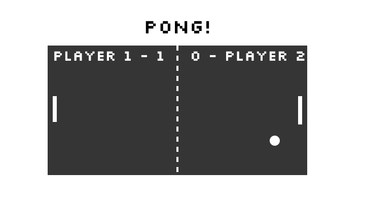

# Ping Pong Game

This is a Ping Pong game for two peopleplayers. The winner of this game will be the first person to score 5 goals. To make this more interesting, once a player score a goal, his paddle will get shorter to give advantage to the other player. Also, in the middle of the game a second ball will appear. To play, the first player use the keys ``W`` to move up and ``S`` to move down. The second player use the arrows on the keyboard.

 

## Tecnologies used

**+JavaScript(JS):** To render the images on the page, give functionalities to each element and also control the score and additional features.

**+NPM: ** Package managet for JavaScript.

**+SVG: * stands for Scalable Vector Graphics. SVG images are rendered with JS to control them with the same language.

## Learnings
+ Crete SVG objects with JavaScript-
+ Control SVG objects to make interactive websites.
+ Create functions and classes. Giving me the idea of Object Oriented Language.

**Sources:**

- [JavaScript Objects](https://www.w3schools.com/js/js_objects.asp)
- [NPM](https://www.npmjs.com/products/teams?utm_source=adwords&utm_medium=ppc&utm_campaign=npmTeams2019Q2&utm_content=site&gclid=CjwKCAiAp5nyBRABEiwApTwjXhHGjSYfTWPFXuWUadV2jG9VCf2lTeBqZDKKkA8MHGqkQB_eTjY3NhoC7WYQAvD_BwE)
- [SVG with JS](https://www.w3schools.com/graphics/svg_intro.asp)

